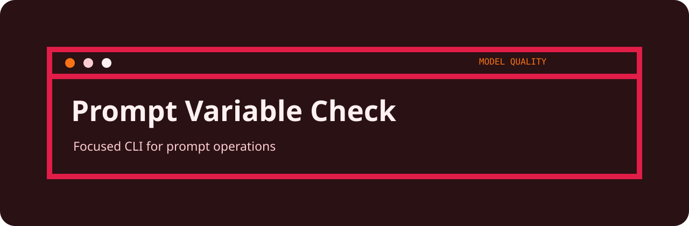
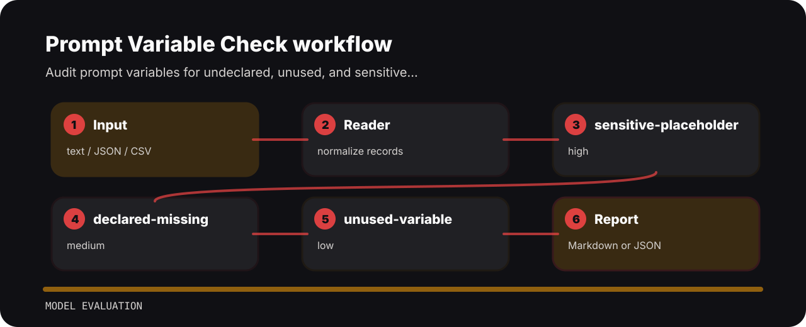

# Prompt Variable Check



## Review intent

Audit prompt variables for undeclared, unused, and sensitive placeholders. It keeps the review small: one input file, a short list of findings, and enough context to fix the line that caused the warning.

## Command path

```bash
git clone https://github.com/mertefekurt/prompt-variable-check.git
cd prompt-variable-check
python -m pip install -e ".[dev]"
prompt-variable-check examples/sample.txt
```

## Signal route



## What gets flagged

| Signal | Level | What it flags | Fix direction |
| --- | --- | --- | --- |
| `sensitive-placeholder` | high | sensitive placeholder detected | avoid sensitive prompt variables |
| `declared-missing` | medium | variable declaration missing | declare all variables |
| `unused-variable` | low | unused variable present | remove stale prompt variable |

## Check before changing

```bash
ruff check .
pytest
python -m prompt_variable_check --help
```
